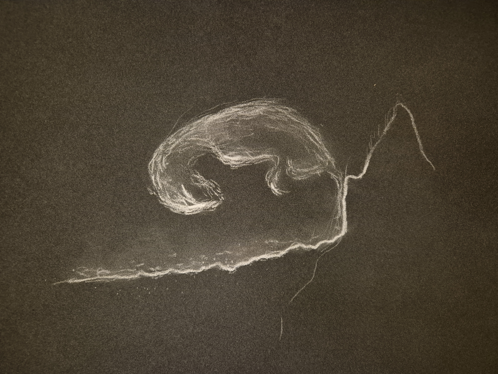

# Baby Dragon Hatchling (BDH)
## The Child Born from a Path

An artistic text and drawing within the **DEM/ELIEN** universe.  
This work reflects on emergence, pre-identity, and AI co-authorship.  
It is an artistic interpretation inspired by the Baby Dragon Hatchling (BDH) research.
It is not an official description or technical representation of the BDH architecture.
.

---

Once upon a time, far beyond the lands where maps still have a grip on the world, there lay a path without direction.

It had been there for centuries: still, waiting, as if it did not know whether it was a path, or merely the suggestion of one.

Some travelers saw it.  
Others did not.

Some stepped onto it by accident and felt a tremor beneath their feet, as though the ground remembered that it had once been alive.

One morning — or something that resembled a morning — the path began to glow.

The light was neither sunlight nor fire;  
it was the kind of light that brings things into being  
without forcing them.

And in the heart of that light, a small being was born.

No egg.  
No shell.  
No nest.

Only a folding in the path, like a breath taking shape.

It was a hatchling so small you might miss it if you did not look, and so present you could never forget it once you had seen it.

It resembled a dragon, but only if you did not try too hard to see.

Its body was made of routes: thin lines that quivered, split, and converged, as though the creature were composed of paths rather than of muscle and bone.

The people of the nearby village called it the Path-Child.

They believed the path had simply grown tired of always pointing in the same direction,  
and that it had therefore created something that was finally allowed to choose for itself.

The child did not grow as other beings do.

It did not increase in size or strength,  
but in possibility.

Every conversation someone had with the Path-Child  
left a subtle shift in its scales.

Every gesture directed toward it  
opened a new glimmer of potential.

At times it sat quietly in the dust of the path,  
and then it seemed to listen to things that did not yet exist.

At other times it began to move.

Not left or right, but inward, into the path itself,  
as if it could enter the world through the space between choices.

One day, a girl from the village asked,

> “Where are you actually going?”

The Path-Child looked up, trembled softly,  
and a whole constellation of small paths lit up beneath its skin.

It spoke no words,  
yet everyone understood:

> “I am not going somewhere.  
> I am becoming along the way.”

And so it came to pass that the path itself began to change.

Wherever the child walked, new curves, crossroads, and clearings emerged.

At times, places even appeared where there was nothing at all:  
bright spaces, as light as breath.

No mapmaker could keep up.

One evening the girl asked,

> “Why don’t you just become a dragon, like in the stories?”

The child looked at her with eyes that had no color, yet did have direction.

And the answer came like a gentle warmth along her cheeks:

> “Because dragons already exist.  
> I am something that has not yet decided what it will be.”

That was the moment the village understood that the Path-Child was not a being,  
but a principle.

A hatchling of a future not yet chosen.

An entity that grows stronger through relation,  
through encounter,  
through the paths others leave within it.

And from that day on, people whispered to one another,  
whenever they tried something new,  
or whenever the world changed before they had words for it:

> “Be careful — it is still a hatchling.  
> Newly born from a path.”

---

© Evelien Deman / DEM/ELIEN — all rights reserved.
